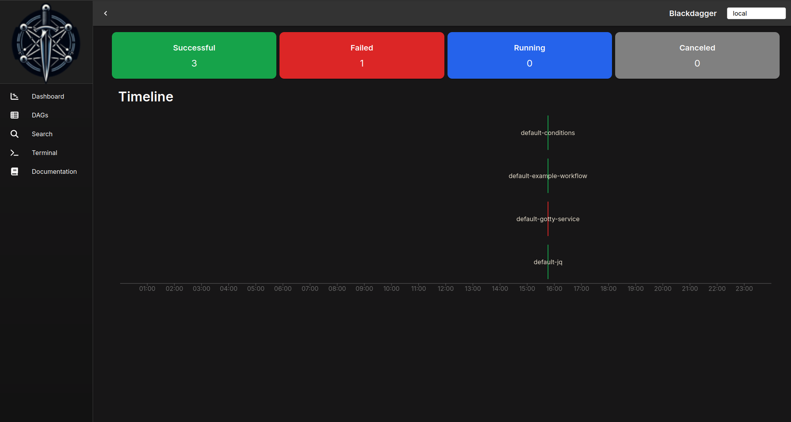
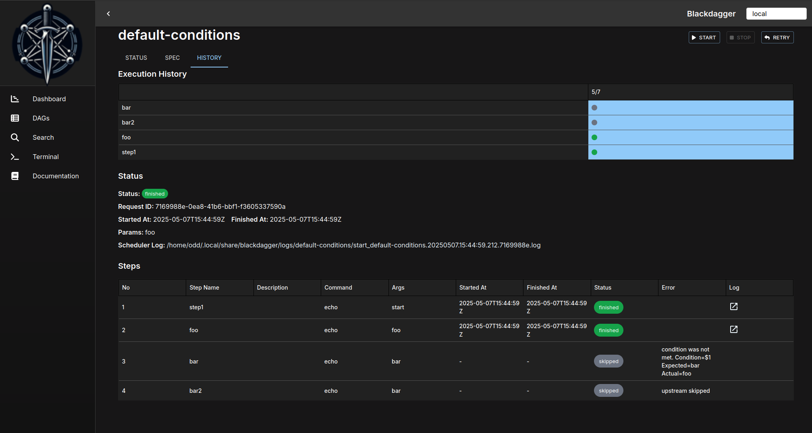
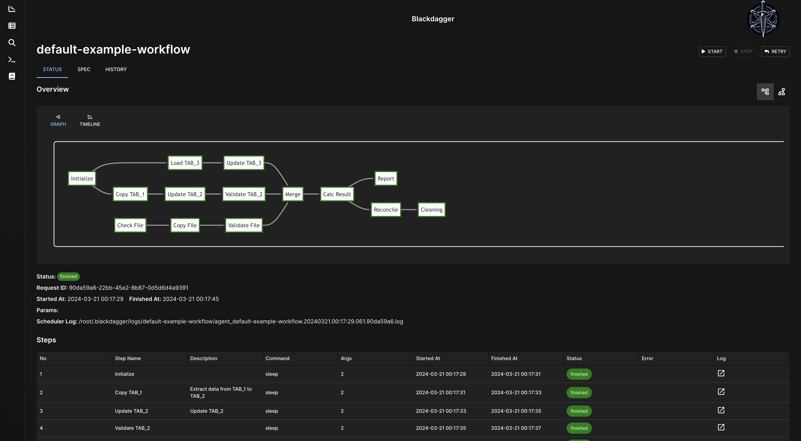

<p align="center">
  
</p>

<p align="center">
  <a href="https://goreportcard.com/report/github.com/ErdemOzgen/blackdagger">
    
  </a>
  <a href="https://codecov.io/gh/ErdemOzgen/blackdagger">
    
  </a>
  <a href="https://github.com/erdemozgen/blackdagger/releases">
    
  </a>
  <a href="https://godoc.org/github.com/ErdemOzgen/blackdagger">
    
  </a>
  
  <a href="https://hub.docker.com/r/erdemozgen/blackdagger">
    
  </a>
</p>

<div align="center">

[Installation](#installation) | [Quick Start Docs](https://blackdagger.readthedocs.io/en/latest/quickstart.html#launch-the-web-ui) | [Blackdagger YAML Creator GPT4](https://chat.openai.com/g/g-joF9jRCLD-blackdagger-yaml-creator)

</div>

<h1><b>Blackdagger</b></h1>


Blackdagger represents a significant advancement in automation technology, offering a comprehensive solution for orchestrating complex workflows in DevOps, DevSecOps, MLOps, MLSecOps, and Continuous Automated Red Teaming (CART) environments.

At its core, Blackdagger simplifies the management and execution of intricate workflows through its user-friendly approach and powerful functionality. Leveraging a declarative YAML format, Blackdagger enables users to define automation pipelines using a Directed Acyclic Graph (DAG), facilitating clear and concise expression of task dependencies and execution logic.

What sets Blackdagger apart is its simplicity and versatility. Unlike traditional cron-based schedulers or workflow orchestration platforms, Blackdagger eliminates the need for extensive scripting or coding. With a built-in Web UI, users can easily manage, rerun, and monitor automation pipelines in real-time, streamlining the workflow management process. Additionally, Blackdagger offers native Docker support, enabling seamless integration with containerized environments, and a versatile toolset for task execution, including making HTTP requests and executing commands over SSH.

**What Sets Blackdagger Apart?**

1. **Declarative YAML Format**: Blackdagger simplifies workflow definition with a declarative YAML format, allowing users to specify command dependencies using a Directed Acyclic Graph (DAG). This intuitive approach makes it easy to define complex workflows and manage task dependencies without the need for extensive scripting or coding.
2. **Web UI for Visual Management**: With its built-in Web UI, Blackdagger provides users with a visually intuitive interface for managing, rerunning, and monitoring automation pipelines. Users can easily track the real-time status of workflows, view execution logs, and make configuration changes directly from their browser, eliminating the need for manual intervention.
3. **Native Docker Support**: Blackdagger natively supports Docker container management, enabling seamless integration with containerized environments. Users can run arbitrary Docker containers as part of their automation workflows, making it easy to orchestrate tasks across distributed infrastructure and microservices architectures.
4. **Versatile Task Execution**: From making HTTP requests to executing commands over SSH, Blackdagger offers a versatile toolset for task execution. Whether it's interacting with external APIs, running custom code snippets, or managing infrastructure components, Blackdagger empowers users to automate a wide range of tasks with ease.

## **Highlights**
- Single binary file installation
- Declarative YAML format for defining DAGs
- Web UI for visually managing, rerunning, and monitoring pipelines
- Use existing programs without any modification
- Self-contained, with no need for a DBMS
- Suitable for Continuous Red Teaming (CART)
- Suitable for DevOps and DevSecOps
- Suitable for MLOps and MLSecOps

You can find everything about Blackdagger, including this README, in our [documentation](https://blackdagger.readthedocs.io).

Below, you can find the **videos** that can help you to get started with Blackdagger:

| Installation and Setup of Blackdagger Video | Usage of Blackdagger Video | DAG Creation and Running in Blackdagger Video|
|:-:|:-:|:-:|
| [](https://www.youtube.com/watch?v=GnFJlfEfxSk) | [](https://www.youtube.com/watch?v=ezeudtCWI3w) | [](https://www.youtube.com/watch?v=1oVbahg1R5I) |

## **Installation**

### Via Bash script

```sh
curl -L https://raw.githubusercontent.com/ErdemOzgen/blackdagger/main/scripts/blackdagger-installer.sh | bash
```
**Important Note:** Within the Blackdagger server, to access the GoTTY web terminal, you must manually start the `default-gotty-service` DAG found in the DAGs section. Blackdagger utilizes GoTTY for web terminal functionality, which, for security reasons, does not automatically start upon system initialization.


### Via Docker


```sh
# In Blackdagger repo run this commmands 
docker compose up 
# If docker compose does not work please try to docker compose build
#docker compose build
# You can access web terminal in http://127.0.0.1:8080
# Also You can access gotty web terminal http://127.0.0.1:8090 username: blackdagger password: blackdagger
# Do not forget run default-gotty-service dags in http://[::]:8080/dags/default-gotty-service .
```

### Via GitHub Release Page

Download the latest binary from the [Releases page](https://github.com/ErdemOzgen/blackdagger/releases) and place it in your `$PATH` (e.g. `/usr/local/bin`).

#### **IMPORTANT:** 
In some YAMLs and/or processes that users want to run by using Blackdagger, `sudo` permission may be required. Therefore, users may need to configure a `sudo` permission before running them. Without this permission, process running, maintaining, stopping features and other Blackdagger features may encounter bugs. Below, you can find different options to configure `sudo` permission:

1. First and **suggested option** is adding user account to the /etc/sudoers file with NOPASSWD permissions, enabling them to execute sudo commands without needing to enter a password. This modification simplifies operations that require elevated privileges by removing the requirement to provide a password for each sudo command.

In the terminal, type the following command to open the sudoers file using a text editor:
```bash
sudo visudo -f /etc/sudoers
```

Scroll down to the bottom of the sudoers file.
Add the following line, replacing "username" with the actual username of the user account you want to grant sudo privileges without a password:

```bash
username ALL=(ALL) NOPASSWD: ALL
```
Save your changes and exit the editor. 


2. To have root privileges you can run Blackdagger with sudo:
```bash
sudo blackdagger start-all
```
But this will create **.blackdagger** folder in root user. It may cause python package issues and pip related problems.

3. To ensure continuous operation of the process on your system, simply create and execute the following script every minute via cron—no root account required:

```bash
#!/bin/bash
process="blackdagger start-all"
command="/usr/bin/blackdagger start-all"

if ps ax | grep -v grep | grep "$process" > /dev/null
then
    exit
else
    $command &
fi

exit
```

### Get Example YAMLs For Various Purposes
After the installation, you can use YAMLs that we created for various purposes. 
We created these YAMLs to help you about mechanisms you can use in Blackdagger and give you inspiration for creating your own YAMLs or modifying ours for your purposes.

For now, we have these categories of YAMLs:
* [Default](https://github.com/ErdemOzgen/blackdagger-default): Default YAMLs that consist of general mechanisms that you can use in any YAML file, such as parallel job running and conditional mechanisms.
* [DevSecOps](https://github.com/ErdemOzgen/blackdagger-devsecops): YAMLs that will help you to setup an environment and install common tools for DevSecOps, along with language specific YAML files that you can use to run DevSecOps processes on your projects.
* [CART](https://github.com/ErdemOzgen/blackdagger-cart): YAMLs that will help you to prepare, plan and perform CART processes. We advise you to use these YAMLs in [Blackcart](https://github.com/ErdemOzgen/blackcart) since there is a pre-configured environment and a whole arsenal for CART purposes.
* DevOps: TBU
* MLOps: TBU
* MLSecOps: TBU

After installing Blackdagger, you can download these YAMLs by their categories by running the command:
```bash
# Categories: mlops, default, devsecops, devops, mlsecops, cart
blackdagger pull <category>
```

This command pulls YAML files from our repositories that you can find above. We created YAML files that are suitable with Blackdagger YAML format and useful for various cases. These YAML files are also tested many times to provide you a fast option to perform your desired actions.


## **Quick Start Guide**

### 1. Launch the Web UI

Start the server and scheduler with the command `blackdagger start-all` or `blackdagger server` and browse to `http://127.0.0.1:8080` to explore the Web UI. 

### 2. Create a New DAG

Navigate to the DAG List page by clicking the menu in the left panel of the Web UI. Then create a DAG by clicking the `New DAG` button at the top of the page. Enter `example` in the dialog.

*Note: DAG (YAML) files will be placed in `~/.blackdagger/dags` by default. See [Configuration Options](https://blackdagger.readthedocs.io/en/latest/config.html) for more details.*

### 3. Edit the DAG

Go to the `SPEC` Tab and hit the `Edit` button. Copy & Paste the following example and click the `Save` button.

Example:
```yaml
schedule: "* * * * *" # Run the DAG every minute
steps:
  - name: s1
    command: echo Hello blackdagger
  - name: s2
    command: echo done!
    depends:
      - s1
```

### 4. Execute the DAG

You can execute the example by pressing the `Start` button. You can see "Hello blackdagger" in the log page in the Web UI.

## **CLI**

```sh
# Runs the DAG
blackdagger start [--params=<params>] <file>

# Displays the current status of the DAG
blackdagger status <file>

# Re-runs the specified DAG run
blackdagger retry --req=<request-id> <file>

# Stops the DAG execution
blackdagger stop <file>

# Restarts the current running DAG
blackdagger restart <file>

# Dry-runs the DAG
blackdagger dry [--params=<params>] <file>

# Launches both the web UI server and scheduler process
blackdagger start-all [--host=<host>] [--port=<port>] [--dags=<path to directory>]

# Launches the blackdagger web UI server
blackdagger server [--host=<host>] [--port=<port>] [--dags=<path to directory>]

# Starts the scheduler process
blackdagger scheduler [--dags=<path to directory>]

# Shows the current binary version
blackdagger version
```

## **Table of Contents**

- [Highlights](#highlights)
- [Installation](#installation)
  - [Via Bash script](#via-bash-script)
  - [Via Docker](#via-docker)
  - [Via GitHub Release Page](#via-github-release-page)
- [CLI](#cli)
- [Documentation](#documentation)
- [Features](#features)
- [Usecase](#usecase)
- [Web UI](#web-ui)
  - [DAG Details](#dag-details)
  - [DAGs List](#dags-list)
  - [Search DAGs](#search-dags)
  - [Execution History](#execution-history)
  - [DAG Execution Log](#dag-execution-log)
- [Quick Start Guide](#quick-start-guide)
  - [Launch the Web UI](#launch-the-web-ui)
  - [Create a New DAG](#create-a-new-dag)
  - [Edit the DAG](#edit-the-dag)
  - [Execute the DAG](#execute-the-dag)
- [Running as a daemon](#running-as-a-daemon)
- [Example Workflow](#example-workflow)
- [Motivation](#motivation)
- [Why Not Use an Existing Workflow Scheduler Like Airflow?](#why-not-use-an-existing-workflow-scheduler-like-airflow)
- [How It Works](#how-it-works)
- [License](#license)
- [Support and Community](#support-and-community)

## **Features**

- Web User Interface
- Command Line Interface (CLI) with several commands for running and managing DAGs
- YAML format for defining DAGs, with support for various features including:
  - Execution of custom code snippets
  - Parameters
  - Command substitution
  - Conditional logic
  - Redirection of stdout and stderr
  - Lifecycle hooks
  - Repeating task
  - Automatic retry
- Executors for running different types of tasks:
  - Running arbitrary Docker containers
  - Making HTTP requests
  - Sending emails
  - Running jq command
  - Executing remote commands via SSH
- Email notification
- Scheduling with Cron expressions
- REST API Interface
- Basic Authentication over HTTPS

## **Usecase**

- **Data Pipeline Automation:** Schedule ETL tasks for data processing and centralization.
- **Infrastructure Monitoring:** Periodically check infrastructure components with HTTP requests or SSH commands.
- **Automated Reporting:** Generate and send periodic reports via email.
- **Batch Processing:** Schedule batch jobs for tasks like data cleansing or model training.
- **Task Dependency Management:** Manage complex workflows with interdependent tasks.
- **Microservices Orchestration:** Define and manage dependencies between microservices.
- **CI/CD Integration:** Automate code deployment, testing, and environment updates.
- **Alerting System:** Create notifications based on specific triggers or conditions.
- **Custom Task Automation:** Define and schedule custom tasks using code snippets.
- **Model Training Automation:** Automate the training of machine learning models by scheduling jobs that run on new data sets. Use Blackdagger to manage dependencies between data preprocessing, training, evaluation, and deployment tasks.
- **Model Deployment Pipeline:** Create a DAG to automate the deployment of trained models to production environments, including steps for model validation, containerization with Docker, and deployment using SSH commands.
- **Security Scans Integration:** Schedule regular security scans and static code analysis as part of the CI/CD pipeline. Use Blackdagger to orchestrate these tasks, ensuring that deployments are halted if vulnerabilities are detected.
- **Automated Compliance Checks:** Set up workflows to automatically run compliance checks against infrastructure and codebase, reporting results via HTTP requests to compliance monitoring tools.
- **Automated Penetration Testing:** Schedule and manage continuous penetration testing activities. Define dependencies in Blackdagger to ensure that penetration tests are conducted after deployment but before wide release, using Docker containers to isolate testing environments.
- **Threat Simulation and Response:** Automate the execution of threat simulations to test the effectiveness of security measures. Use Blackdagger to orchestrate complex scenarios involving multiple steps, such as breaching a system, escalating privileges, and exfiltrating data, followed by automated rollback and alerting.


## **Web UI**

### DAG Details

  Main index page of blackdagger. It shows dag status and timeline for all dags.
  
  

  It shows the real-time status, logs, and DAG configurations. You can edit DAG configurations on a browser.
  You can switch to the vertical graph with the button on the top right corner.

  

### DAGs List

It shows all DAGs and the real-time status.

  

### Search DAGs

It greps given text across all DAGs.
  

### Execution History

It shows past execution results and logs.

  

### DAG Execution Log

It shows the detail log and standard output of each execution and step.

  


## **Documentation**

- [Installation Instructions](https://blackdagger.readthedocs.io/en/latest/installation.html)
- ️[Quick Start Guide](https://blackdagger.readthedocs.io/en/latest/quickstart.html)
- [Command Line Interface](https://blackdagger.readthedocs.io/en/latest/cli.html)
- [Web User Interface](https://blackdagger.readthedocs.io/en/latest/web_interface.html)
- YAML Format
  - [Minimal DAG Definition](https://blackdagger.readthedocs.io/en/latest/yaml_format.html#minimal-dag-definition)
  - [Running Arbitrary Code Snippets](https://blackdagger.readthedocs.io/en/latest/yaml_format.html#running-arbitrary-code-snippets)
  - [Defining Environment Variables](https://blackdagger.readthedocs.io/en/latest/yaml_format.html#defining-environment-variables)
  - [Defining and Using Parameters](https://blackdagger.readthedocs.io/en/latest/yaml_format.html#defining-and-using-parameters)
  - [Using Command Substitution](https://blackdagger.readthedocs.io/en/latest/yaml_format.html#using-command-substitution)
  - [Adding Conditional Logic](https://blackdagger.readthedocs.io/en/latest/yaml_format.html#adding-conditional-logic)
  - [Setting Environment Variables with Standard Output](https://blackdagger.readthedocs.io/en/latest/yaml_format.html#setting-environment-variables-with-standard-output)
  - [Redirecting Stdout and Stderr](https://blackdagger.readthedocs.io/en/latest/yaml_format.html#redirecting-stdout-and-stderr)
  - [Adding Lifecycle Hooks](https://blackdagger.readthedocs.io/en/latest/yaml_format.html#adding-lifecycle-hooks)
  - [Repeating a Task at Regular Intervals](https://blackdagger.readthedocs.io/en/latest/yaml_format.html#repeating-a-task-at-regular-intervals)
  - [All Available Fields for DAGs](https://blackdagger.readthedocs.io/en/latest/yaml_format.html#all-available-fields-for-dags)
  - [All Available Fields for Steps](https://blackdagger.readthedocs.io/en/latest/yaml_format.html#all-available-fields-for-steps)
- Example DAGs
  - [Hello World](https://blackdagger.readthedocs.io/en/latest/examples.html#hello-world)
  - [Conditional Steps](https://blackdagger.readthedocs.io/en/latest/examples.html#conditional-steps)
  - [File Output](https://blackdagger.readthedocs.io/en/latest/examples.html#file-output)
  - [Passing Output to Next Step](https://blackdagger.readthedocs.io/en/latest/examples.html#passing-output-to-next-step)
  - [Running a Docker Container](https://blackdagger.readthedocs.io/en/latest/examples.html#running-a-docker-container)
  - [Sending HTTP Requests](https://blackdagger.readthedocs.io/en/latest/examples.html#sending-http-requests)
  - [Querying JSON Data with jq](https://blackdagger.readthedocs.io/en/latest/examples.html#querying-json-data-with-jq)
  - [Sending Email](https://blackdagger.readthedocs.io/en/latest/examples.html#sending-email)
- [Configurations](https://blackdagger.readthedocs.io/en/latest/config.html)
- [Scheduler](https://blackdagger.readthedocs.io/en/latest/scheduler.html)
- [Docker Compose](https://blackdagger.readthedocs.io/en/latest/docker-compose.html)
- [REST API Documentation](https://app.swaggerhub.com/apis/ErdemOzgen/blackdagger)


## **Example Workflow**

This example workflow showcases a data pipeline typically implemented in DevOps and Data Engineering scenarios. It demonstrates an end-to-end data processing cycle starting from data acquisition and cleansing to transformation, loading, analysis, reporting, and ultimately, cleanup.



The YAML code below represents this workflow:

```yaml
# Environment variables used throughout the pipeline
env:
  - DATA_DIR: /data
  - SCRIPT_DIR: /scripts
  - LOG_DIR: /log
  # ... other variables can be added here

# Handlers to manage errors and cleanup after execution
handlerOn:
  failure:
    command: "echo error"
  exit:
    command: "echo clean up"

# The schedule for the workflow execution in cron format
# This schedule runs the workflow daily at 12:00 AM
schedule: "0 0 * * *"

steps:
  # Step 1: Pull the latest data from a data source
  - name: pull_data
    command: "bash"
    script: |
      echo `date '+%Y-%m-%d'`
    output: DATE

 # Step 2: Cleanse and prepare the data
  - name: cleanse_data
    command: echo cleansing ${DATA_DIR}/${DATE}.csv
    depends:
      - pull_data

  # Step 3: Transform the data
  - name: transform_data
    command: echo transforming ${DATA_DIR}/${DATE}_clean.csv
    depends:
      - cleanse_data

  # Parallel Step 1: Load the data into a database
  - name: load_data
    command: echo loading ${DATA_DIR}/${DATE}_transformed.csv
    depends:
      - transform_data

  # Parallel Step 2: Generate a statistical report
  - name: generate_report
    command: echo generating report ${DATA_DIR}/${DATE}_transformed.csv
    depends:
      - transform_data

  # Step 4: Run some analytics
  - name: run_analytics
    command: echo running analytics ${DATA_DIR}/${DATE}_transformed.csv
    depends:
      - load_data

  # Step 5: Send an email report
  - name: send_report
    command: echo sending email ${DATA_DIR}/${DATE}_analytics.csv
    depends:
      - run_analytics
      - generate_report

  # Step 6: Cleanup temporary files
  - name: cleanup
    command: echo removing ${DATE}*.csv
    depends:
      - send_report
```

## **Motivation**

Legacy systems often have complex and implicit dependencies between jobs. When there are hundreds of cron jobs on a server, it can be difficult to keep track of these dependencies and to determine which job to rerun if one fails. It can also be a hassle to SSH into a server to view logs and manually rerun shell scripts one by one. blackdagger aims to solve these problems by allowing you to explicitly visualize and manage pipeline dependencies as a DAG, and by providing a web UI for checking dependencies, execution status, and logs and for rerunning or stopping jobs with a simple mouse click.

## **Why Not Use an Existing Workflow Scheduler Like Airflow?**

While there are numerous workflow schedulers like Airflow available, these often necessitate the authoring of DAGs through programming languages such as Python. For legacy systems with extensive job configurations, incorporating code in languages like Perl or Shell Script can already be a complex endeavor. Introducing an additional layer with such tools can further complicate maintainability. In contrast, BlackDagger is crafted for simplicity and usability, requiring no coding skills. This makes it a perfect fit for smaller projects looking for a straightforward, self-sufficient workflow management solution.


## **How It Works**

BlackDagger simplifies workflow management by operating as a standalone command-line tool, leveraging the local file system for data storage — eliminating the need for database management systems or cloud services. It enables the definition of DAGs in an intuitive, declarative YAML format, ensuring that existing programs can be seamlessly integrated without any modifications.


Feel free to contribute in any way you want! Share ideas, questions, submit issues, and create pull requests. Check out our [Contribution Guide](https://blackdagger.readthedocs.io/en/latest/contrib.html) for help getting started.

We welcome any and all contributions!


## **Roadmap**

Blackdagger is committed to continuous improvement and the development of new features to enhance its usability and functionality. Our roadmap is guided by feedback from our users and our vision for making workflow management as intuitive and efficient as possible. Here's what's on the horizon:

### **Short-term Goals**
- **Enhanced User Interface**: We're working on further improving the Web UI for an even more intuitive and user-friendly experience. This includes better navigation, more detailed execution logs, and streamlined DAG management.
- **Increased Task Types**: Adding support for more types of tasks, including advanced data processing and analytics tasks, to broaden the use cases Blackdagger can cover.
- **Improved Documentation**: Expanding our documentation to include more examples, use cases, and best practices to help users get the most out of Blackdagger.

### **Mid-term Initiatives**
- **Plugin Architecture**: Developing a plugin system to allow for easy integration with external tools and services, enhancing Blackdagger's versatility and adaptability.
- **Advanced Scheduling Features**: Implementing more sophisticated scheduling options to cater to complex workflow requirements, including conditional triggers(current will be updated) and event-driven execution.
- **Security Enhancements**: Strengthening security features to ensure secure execution of tasks, especially in sensitive or production environments.

### **Long-term Vision**
- **Machine Learning and AI Integration**: Exploring ways to incorporate ML and AI capabilities to automate decision-making within workflows, such as dynamic adjustment of task execution based on previous outcomes.
- **Community-Driven Development**: Building a vibrant community around Blackdagger, encouraging contributions, and fostering an ecosystem of plugins and integrations.
- **Global Adoption and Localization**: Making Blackdagger accessible to a global audience through localization and support for multiple languages.

We are excited about the journey ahead and invite the community to contribute ideas, feedback, and code to help make Blackdagger the go-to solution for workflow management. Stay tuned for updates and join us in shaping the future of Blackdagger!

### TODOS for Roadmap

- [ ] Create more executors see in [here](#executor-roadmap)
- [ ] Create more playbooks for Default,DevOps, DevSecOps, MLOps, MLSecOps, and Continuous Automated Red Teaming (CART) environments.
- [ ] Support for importing different DAGs within the same DAG using import statements, enabling modular workflow design.
- [ ] Implementation of centralized control, allowing BlackDagger to function as an agent for streamlined management.
- [ ] Enhancement of log collection features to include forwarding logs to a central server for aggregated analysis.
- [ ] Addition of functionality to generate reports in DOCX and PDF formats for improved documentation and reporting.
- [ ] Integration with ChatGPT and offline language models for automated document generation, enhancing documentation efficiency.

## Executor Roadmap

- [ ] **Kubernetes Executor**
  - **Description**: Executes tasks as Kubernetes jobs, allowing for scalable and efficient containerized job execution in a Kubernetes cluster.
  - **Use Case**: Ideal for scaling tasks that require isolation, resource control, or need to run in a specific container environment.

- [ ] **Lambda Executor**
  - **Description**: Triggers AWS Lambda functions, enabling serverless execution of tasks without provisioning or managing servers.
  - **Use Case**: Perfect for lightweight, event-driven tasks such as data transformation, real-time file processing, or integrating with AWS services.

- [ ] **Terraform Executor**
  - **Description**: Runs Terraform commands to apply infrastructure as code configurations, supporting the automated setup and teardown of cloud resources.
  - **Use Case**: Useful for DevOps pipelines that require dynamic environment provisioning for testing, staging, or production deployments.

- [ ] **Webhook Executor**
  - **Description**: Sends data to specified URLs via webhooks, allowing for easy integration with external systems and services.
  - **Use Case**: Ideal for triggering notifications, external workflows, or updating third-party systems as part of a workflow.

- [ ] **Machine Learning Model Executor**
  - **Description**: Executes machine learning model inference jobs, supporting various ML frameworks.
  - **Use Case**: Can be used for batch processing of data through pre-trained models, such as image recognition, sentiment analysis, or predictive analytics.

- [ ] **Data Pipeline Executor**
  - **Description**: Manages and executes data pipeline tasks, such as ETL (Extract, Transform, Load) operations, supporting integration with popular data processing frameworks.
  - **Use Case**: Useful for data engineering workflows, including data extraction from various sources, transformation, and loading into data stores or warehouses.

- [ ] **Browser Automation Executor**
  - **Description**: Executes browser automation scripts using tools like Selenium or Puppeteer for web scraping, automated testing, or any task requiring browser interaction.
  - **Use Case**: Ideal for automated end-to-end web application testing, data extraction from web pages, or automating repetitive web tasks.

- [ ] **Ansible Executor**
  - **Description**: Executes Ansible playbooks for configuration management and application deployment.
  - **Use Case**: Great for ensuring consistent environment configuration, deploying applications, and managing changes across distributed infrastructure.

- [ ] **Jupyter Notebook Executor**
  - **Description**: Executes Jupyter notebooks, allowing for data analysis and visualization tasks to be part of automated workflows.
  - **Use Case**: Suitable for integrating data science and exploratory data analysis into automated processes, including preprocessing, analysis, and visualization.

- [ ] **IoT Device Executor**
  - **Description**: Sends commands or updates to IoT devices, supporting device management and automation across IoT networks.
  - **Use Case**: Useful for IoT applications needing orchestrated control or updates across multiple devices, such as smart home systems, industrial automation, or health monitoring devices.


## **License**

This project is licensed under the GNU GPLv3. It was forked from [Dagu](https://github.com/dagu-dev/dagu) and has been adapted to serve a different purpose. While Dagu is an excellent project, its current objectives do not align with ours.
