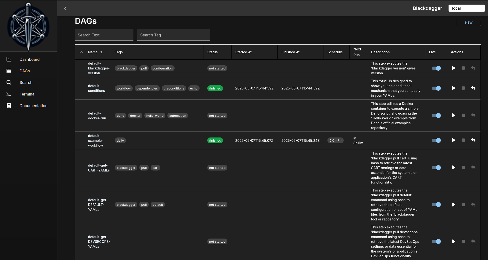
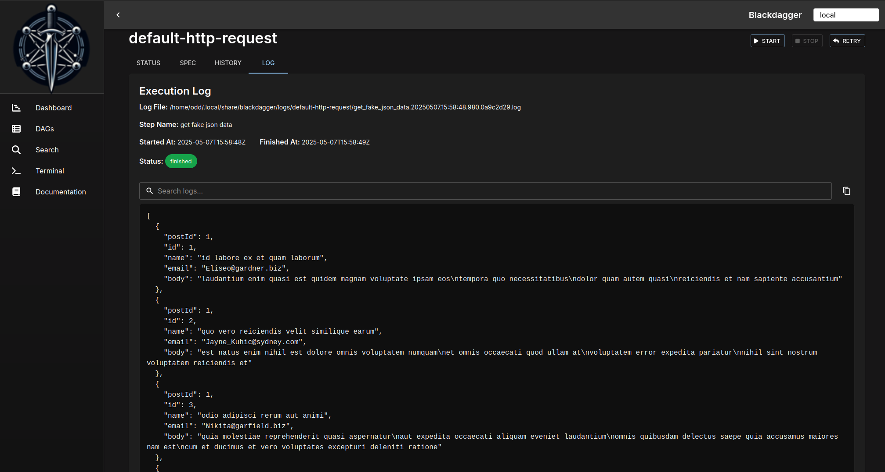

<p align="center">
  
</p>

<p align="center">
  <a href="https://goreportcard.com/report/github.com/ErdemOzgen/blackdagger">
    
  </a>
  <a href="https://codecov.io/gh/ErdemOzgen/blackdagger">
    
  </a>
  <a href="https://github.com/erdemozgen/blackdagger/releases">
    
  </a>
  <a href="https://godoc.org/github.com/ErdemOzgen/blackdagger">
    
  </a>
  
</p>

<div align="center">

[Installation](#installation) | [Quick Start Docs](https://blackdagger.readthedocs.io/en/latest/quickstart.html#launch-the-web-ui) 

</div>

<h1><b>Blackdagger</b></h1>


Blackdagger represents a significant advancement in automation technology, offering a comprehensive solution for orchestrating complex workflows in DevOps, DevSecOps, MLOps, MLSecOps, and Continuous Red Teaming (CART) environments.

At its core, Blackdagger simplifies the management and execution of intricate workflows through its user-friendly approach and powerful functionality. Leveraging a declarative YAML format, Blackdagger enables users to define automation pipelines using a Directed Acyclic Graph (DAG), facilitating clear and concise expression of task dependencies and execution logic.

What sets Blackdagger apart is its simplicity and versatility. Unlike traditional cron-based schedulers or workflow orchestration platforms, Blackdagger eliminates the need for extensive scripting or coding. With a built-in Web UI, users can easily manage, rerun, and monitor automation pipelines in real-time, streamlining the workflow management process. Additionally, Blackdagger offers native Docker support, enabling seamless integration with containerized environments, and a versatile toolset for task execution, including making HTTP requests and executing commands over SSH.

**What Sets Blackdagger Apart?**

1. **Declarative YAML Format**: Blackdagger simplifies workflow definition with a declarative YAML format, allowing users to specify command dependencies using a Directed Acyclic Graph (DAG). This intuitive approach makes it easy to define complex workflows and manage task dependencies without the need for extensive scripting or coding.
2. **Web UI for Visual Management**: With its built-in Web UI, Blackdagger provides users with a visually intuitive interface for managing, rerunning, and monitoring automation pipelines. Users can easily track the real-time status of workflows, view execution logs, and make configuration changes directly from their browser, eliminating the need for manual intervention.
3. **Native Docker Support**: Blackdagger natively supports Docker container management, enabling seamless integration with containerized environments. Users can run arbitrary Docker containers as part of their automation workflows, making it easy to orchestrate tasks across distributed infrastructure and microservices architectures.
4. **Versatile Task Execution**: From making HTTP requests to executing commands over SSH, Blackdagger offers a versatile toolset for task execution. Whether it's interacting with external APIs, running custom code snippets, or managing infrastructure components, Blackdagger empowers users to automate a wide range of tasks with ease.

## **Highlights**
- Single binary file installation
- Declarative YAML format for defining DAGs
- Web UI for visually managing, rerunning, and monitoring pipelines
- Use existing programs without any modification
- Self-contained, with no need for a DBMS
- Suitable for Continuous Red Teaming (CART)
- Suitable for DevOps and DevSecOps
- Suitable for MLOps and MLSecOps

You can find everything about Blackdagger, including this README, in our [documentation](https://blackdagger.readthedocs.io).


## **Installation**


### Via Bash script

```sh
curl -L https://raw.githubusercontent.com/ErdemOzgen/blackdagger/main/scripts/downloader.sh | bash
```

### Via Docker

```sh
# in blackdagger repo
docker compose up 
```

### ViaGitHubReleasePage'></a>Via GitHub Release Page 

Download the latest binary from the [Releases page](https://github.com/ErdemOzgen/blackdagger/releases) and place it in your `$PATH` (e.g. `/usr/local/bin`).

## **Running as a daemon**

** If you need root privallages you can use it **


To ensure continuous operation of the process on your system, simply create and execute the following script every minute via cron—no root account required:

```bash
#!/bin/bash
process="blackdagger start-all"
command="/usr/bin/blackdagger start-all"

if ps ax | grep -v grep | grep "$process" > /dev/null
then
    exit
else
    $command &
fi

exit
```

If running as daemon what you need and you need still root privallages you can run:
```bash
sudo blackdagger start-all
```
But this will create **.blackdagger** folder in root user. It may cause python package issues and pip related problems.

Last options is adding user account to the /etc/sudoers file with nopasswd permissions, enabling them to execute sudo commands without needing to enter a password. This modification simplifies operations that require elevated privileges by removing the requirement to provide a password for each sudo command.

```bash
# In /etc/sudoers
username ALL=(ALL) NOPASSWD: ALL
```


## **Table of Contents**

- [Highlights](#highlights)
- [Contents](#contents)
- [Features](#features)
- [Usecase](#usecase)
- [Web UI](#web-ui)
  - [DAG Details](#dag-details)
  - [DAGs List](#dags-list)
  - [Search DAGs](#search-dags)
  - [Execution History](#execution-history)
  - [DAG Execution Log](#dag-execution-log)
- [Installation](#installation)
  - [Via Bash script](#via-bash-script)
  - [Via Docker](#via-docker)
  - [Via GitHub Release Page](#via-github-release-page)
- [Quick Start Guide](#quick-start-guide)
  - [Launch the Web UI](#launch-the-web-ui)
  - [Create a New DAG](#create-a-new-dag)
  - [Edit the DAG](#edit-the-dag)
  - [Execute the DAG](#execute-the-dag)
- [CLI](#cli)
- [Documentation](#documentation)
- [Running as a daemon](#running-as-a-daemon)
- [Example Workflow](#example-workflow)
- [Motivation](#motivation)
- [Why Not Use an Existing Workflow Scheduler Like Airflow?](#why-not-use-an-existing-workflow-scheduler-like-airflow)
- [How It Works](#how-it-works)
- [License](#license)
- [Support and Community](#support-and-community)

## **Features**

- Web User Interface
- Command Line Interface (CLI) with several commands for running and managing DAGs
- YAML format for defining DAGs, with support for various features including:
  - Execution of custom code snippets
  - Parameters
  - Command substitution
  - Conditional logic
  - Redirection of stdout and stderr
  - Lifecycle hooks
  - Repeating task
  - Automatic retry
- Executors for running different types of tasks:
  - Running arbitrary Docker containers
  - Making HTTP requests
  - Sending emails
  - Running jq command
  - Executing remote commands via SSH
- Email notification
- Scheduling with Cron expressions
- REST API Interface
- Basic Authentication over HTTPS

## **Usecase**

- **Data Pipeline Automation:** Schedule ETL tasks for data processing and centralization.
- **Infrastructure Monitoring:** Periodically check infrastructure components with HTTP requests or SSH commands.
- **Automated Reporting:** Generate and send periodic reports via email.
- **Batch Processing:** Schedule batch jobs for tasks like data cleansing or model training.
- **Task Dependency Management:** Manage complex workflows with interdependent tasks.
- **Microservices Orchestration:** Define and manage dependencies between microservices.
- **CI/CD Integration:** Automate code deployment, testing, and environment updates.
- **Alerting System:** Create notifications based on specific triggers or conditions.
- **Custom Task Automation:** Define and schedule custom tasks using code snippets.
- **Model Training Automation:** Automate the training of machine learning models by scheduling jobs that run on new data sets. Use Blackdagger to manage dependencies between data preprocessing, training, evaluation, and deployment tasks.
- **Model Deployment Pipeline:** Create a DAG to automate the deployment of trained models to production environments, including steps for model validation, containerization with Docker, and deployment using SSH commands.
- **Security Scans Integration:** Schedule regular security scans and static code analysis as part of the CI/CD pipeline. Use Blackdagger to orchestrate these tasks, ensuring that deployments are halted if vulnerabilities are detected.
- **Automated Compliance Checks:** Set up workflows to automatically run compliance checks against infrastructure and codebase, reporting results via HTTP requests to compliance monitoring tools.
- **Automated Penetration Testing:** Schedule and manage continuous penetration testing activities. Define dependencies in Blackdagger to ensure that penetration tests are conducted after deployment but before wide release, using Docker containers to isolate testing environments.
- **Threat Simulation and Response:** Automate the execution of threat simulations to test the effectiveness of security measures. Use Blackdagger to orchestrate complex scenarios involving multiple steps, such as breaching a system, escalating privileges, and exfiltrating data, followed by automated rollback and alerting.


## **Web UI**

### DAG Details

It shows the real-time status, logs, and DAG configurations. You can edit DAG configurations on a browser.

  

  You can switch to the vertical graph with the button on the top right corner.

  

### DAGs List

It shows all DAGs and the real-time status.

  

### Search DAGs

It greps given text across all DAGs.
  

### Execution History

It shows past execution results and logs.

  

### DAG Execution Log

It shows the detail log and standard output of each execution and step.

  


## **Quick Start Guide**

### 1. Launch the Web UI

Start the server and scheduler with the command `blackdagger start-all` and browse to `http://127.0.0.1:8080` to explore the Web UI.

### 2. Create a New DAG

Navigate to the DAG List page by clicking the menu in the left panel of the Web UI. Then create a DAG by clicking the `New DAG` button at the top of the page. Enter `example` in the dialog.

*Note: DAG (YAML) files will be placed in `~/.blackdagger/dags` by default. See [Configuration Options](https://blackdagger.readthedocs.io/en/latest/config.html) for more details.*

### 3. Edit the DAG

Go to the `SPEC` Tab and hit the `Edit` button. Copy & Paste the following example and click the `Save` button.

Example:
```yaml
schedule: "* * * * *" # Run the DAG every minute
steps:
  - name: s1
    command: echo Hello blackdagger
  - name: s2
    command: echo done!
    depends:
      - s1
```

### 4. Execute the DAG

You can execute the example by pressing the `Start` button. You can see "Hello blackdagger" in the log page in the Web UI.

## **CLI**

```sh
# Runs the DAG
blackdagger start [--params=<params>] <file>

# Displays the current status of the DAG
blackdagger status <file>

# Re-runs the specified DAG run
blackdagger retry --req=<request-id> <file>

# Stops the DAG execution
blackdagger stop <file>

# Restarts the current running DAG
blackdagger restart <file>

# Dry-runs the DAG
blackdagger dry [--params=<params>] <file>

# Launches both the web UI server and scheduler process
blackdagger start-all [--host=<host>] [--port=<port>] [--dags=<path to directory>]

# Launches the blackdagger web UI server
blackdagger server [--host=<host>] [--port=<port>] [--dags=<path to directory>]

# Starts the scheduler process
blackdagger scheduler [--dags=<path to directory>]

# Shows the current binary version
blackdagger version
```

## **Documentation**

- [Installation Instructions](https://blackdagger.readthedocs.io/en/latest/installation.html)
- ️[Quick Start Guide](https://blackdagger.readthedocs.io/en/latest/quickstart.html)
- [Command Line Interface](https://blackdagger.readthedocs.io/en/latest/cli.html)
- [Web User Interface](https://blackdagger.readthedocs.io/en/latest/web_interface.html)
- YAML Format
  - [Minimal DAG Definition](https://blackdagger.readthedocs.io/en/latest/yaml_format.html#minimal-dag-definition)
  - [Running Arbitrary Code Snippets](https://blackdagger.readthedocs.io/en/latest/yaml_format.html#running-arbitrary-code-snippets)
  - [Defining Environment Variables](https://blackdagger.readthedocs.io/en/latest/yaml_format.html#defining-environment-variables)
  - [Defining and Using Parameters](https://blackdagger.readthedocs.io/en/latest/yaml_format.html#defining-and-using-parameters)
  - [Using Command Substitution](https://blackdagger.readthedocs.io/en/latest/yaml_format.html#using-command-substitution)
  - [Adding Conditional Logic](https://blackdagger.readthedocs.io/en/latest/yaml_format.html#adding-conditional-logic)
  - [Setting Environment Variables with Standard Output](https://blackdagger.readthedocs.io/en/latest/yaml_format.html#setting-environment-variables-with-standard-output)
  - [Redirecting Stdout and Stderr](https://blackdagger.readthedocs.io/en/latest/yaml_format.html#redirecting-stdout-and-stderr)
  - [Adding Lifecycle Hooks](https://blackdagger.readthedocs.io/en/latest/yaml_format.html#adding-lifecycle-hooks)
  - [Repeating a Task at Regular Intervals](https://blackdagger.readthedocs.io/en/latest/yaml_format.html#repeating-a-task-at-regular-intervals)
  - [All Available Fields for DAGs](https://blackdagger.readthedocs.io/en/latest/yaml_format.html#all-available-fields-for-dags)
  - [All Available Fields for Steps](https://blackdagger.readthedocs.io/en/latest/yaml_format.html#all-available-fields-for-steps)
- Example DAGs
  - [Hello World](https://blackdagger.readthedocs.io/en/latest/examples.html#hello-world)
  - [Conditional Steps](https://blackdagger.readthedocs.io/en/latest/examples.html#conditional-steps)
  - [File Output](https://blackdagger.readthedocs.io/en/latest/examples.html#file-output)
  - [Passing Output to Next Step](https://blackdagger.readthedocs.io/en/latest/examples.html#passing-output-to-next-step)
  - [Running a Docker Container](https://blackdagger.readthedocs.io/en/latest/examples.html#running-a-docker-container)
  - [Sending HTTP Requests](https://blackdagger.readthedocs.io/en/latest/examples.html#sending-http-requests)
  - [Querying JSON Data with jq](https://blackdagger.readthedocs.io/en/latest/examples.html#querying-json-data-with-jq)
  - [Sending Email](https://blackdagger.readthedocs.io/en/latest/examples.html#sending-email)
- [Configurations](https://blackdagger.readthedocs.io/en/latest/config.html)
- [Scheduler](https://blackdagger.readthedocs.io/en/latest/scheduler.html)
- [Docker Compose](https://blackdagger.readthedocs.io/en/latest/docker-compose.html)
- [REST API Documentation](https://app.swaggerhub.com/apis/ErdemOzgen/blackdagger)


## **Example Workflow**

This example workflow showcases a data pipeline typically implemented in DevOps and Data Engineering scenarios. It demonstrates an end-to-end data processing cycle starting from data acquisition and cleansing to transformation, loading, analysis, reporting, and ultimately, cleanup.


The YAML code below represents this workflow:

```yaml
# Environment variables used throughout the pipeline
env:
  - DATA_DIR: /data
  - SCRIPT_DIR: /scripts
  - LOG_DIR: /log
  # ... other variables can be added here

# Handlers to manage errors and cleanup after execution
handlerOn:
  failure:
    command: "echo error"
  exit:
    command: "echo clean up"

# The schedule for the workflow execution in cron format
# This schedule runs the workflow daily at 12:00 AM
schedule: "0 0 * * *"

steps:
  # Step 1: Pull the latest data from a data source
  - name: pull_data
    command: "bash"
    script: |
      echo `date '+%Y-%m-%d'`
    output: DATE

 # Step 2: Cleanse and prepare the data
  - name: cleanse_data
    command: echo cleansing ${DATA_DIR}/${DATE}.csv
    depends:
      - pull_data

  # Step 3: Transform the data
  - name: transform_data
    command: echo transforming ${DATA_DIR}/${DATE}_clean.csv
    depends:
      - cleanse_data

  # Parallel Step 1: Load the data into a database
  - name: load_data
    command: echo loading ${DATA_DIR}/${DATE}_transformed.csv
    depends:
      - transform_data

  # Parallel Step 2: Generate a statistical report
  - name: generate_report
    command: echo generating report ${DATA_DIR}/${DATE}_transformed.csv
    depends:
      - transform_data

  # Step 4: Run some analytics
  - name: run_analytics
    command: echo running analytics ${DATA_DIR}/${DATE}_transformed.csv
    depends:
      - load_data

  # Step 5: Send an email report
  - name: send_report
    command: echo sending email ${DATA_DIR}/${DATE}_analytics.csv
    depends:
      - run_analytics
      - generate_report

  # Step 6: Cleanup temporary files
  - name: cleanup
    command: echo removing ${DATE}*.csv
    depends:
      - send_report
```

## **Motivation**

Legacy systems often have complex and implicit dependencies between jobs. When there are hundreds of cron jobs on a server, it can be difficult to keep track of these dependencies and to determine which job to rerun if one fails. It can also be a hassle to SSH into a server to view logs and manually rerun shell scripts one by one. blackdagger aims to solve these problems by allowing you to explicitly visualize and manage pipeline dependencies as a DAG, and by providing a web UI for checking dependencies, execution status, and logs and for rerunning or stopping jobs with a simple mouse click.

## **Why Not Use an Existing Workflow Scheduler Like Airflow?**

There are many existing tools such as Airflow, but many of these require you to write code in a programming language like Python to define your DAG. For systems that have been in operation for a long time, there may already be complex jobs with hundreds of thousands of lines of code written in languages like Perl or Shell Script. Adding another layer of complexity on top of these codes can reduce maintainability. blackdagger was designed to be easy to use, self-contained, and require no coding, making it ideal for small projects.

## **How It Works**

blackdagger is a single command line tool that uses the local file system to store data, so no database management system or cloud service is required. DAGs are defined in a declarative YAML format, and existing programs can be used without modification.

----

Feel free to contribute in any way you want! Share ideas, questions, submit issues, and create pull requests. Check out our [Contribution Guide](https://blackdagger.readthedocs.io/en/latest/contrib.html) for help getting started.

We welcome any and all contributions!

## **License**

This project is licensed under the GNU GPLv3. It was forked from [Dagu](https://github.com/dagu-dev/dagu) and has been adapted to serve a different purpose. While Dagu is an excellent project, its current objectives do not align with ours.