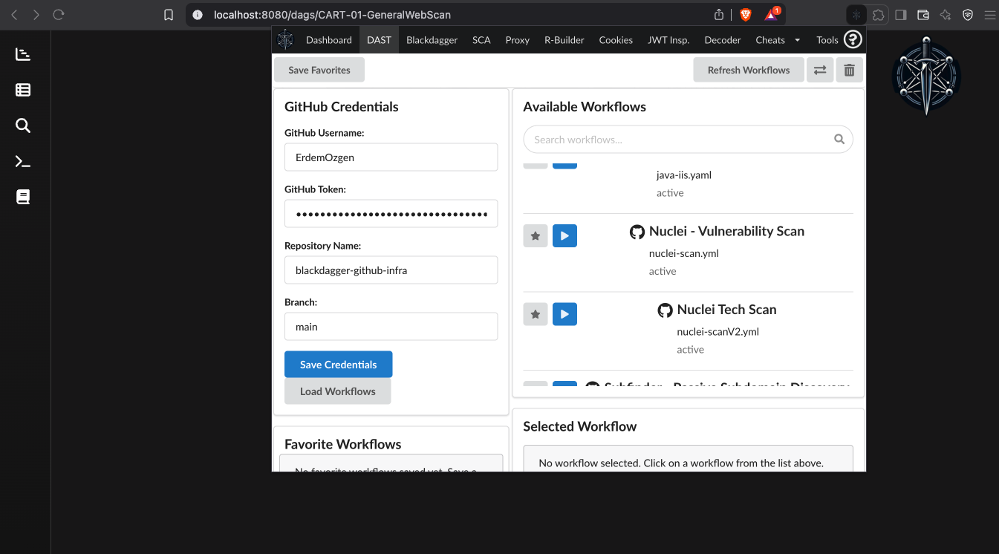
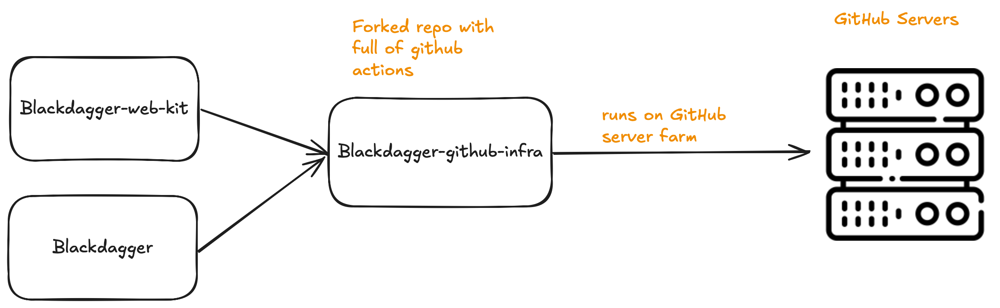

Blackdagger Github Infra
======================================
.. raw:: html

   

      

      <iframe src="https://ghbtns.com/github-btn.html?user=ErdemOzgen&repo=blackdagger-github-infra&type=star&count=true&size=large" frameborder="0" scrolling="0" width="160px" height="30px"></iframe>
      

   

Blackdagger GitHub Infra revolutionizes DAST (Dynamic Application Security Testing) by leveraging GitHub Actions runners for enhanced operational security. This guide will walk you through setting up and using the system for your security testing needs.

Why Use GitHub Runners for DAST?
------------------------------
- Enhanced OPSEC: Perform scans from GitHub's trusted infrastructure
- Avoid Detection: Reduce likelihood of detection by web defenses
- Bypass IP Blocking: Get around IP-based blocking mechanisms
- Stealthy Operations: Conduct security testing with minimal digital footprint

Setup Instructions
--------------------

Step 1: Fork the Repository

1. Visit the blackdagger-github-infra GitHub repository

2. Click the "Fork" button in the upper right corner

3. Wait for the repository to be forked to your account

Step 2: Generate a GitHub Personal Access Token

1. Go to your GitHub account settings

2. Navigate to Developer Settings > Personal Access Tokens > Tokens (classic)

3. Click "Generate new token"

4. Select the following permissions:

- repo (Full control of private repositories)

- workflow (Update GitHub Action workflows)

5. Set an expiration date as needed

6. Click "Generate token"

7. Copy the token immediately (you won't be able to see it again)

Step 3: Configure Blackdagger Web Kit

1. Install the Blackdagger Web Kit extension in your browser

2. Open the Web Kit interface

3. Navigate to the DAST settings section

4. Fill in the required fields:

- Username: Your GitHub username

- Repository Name: Your forked repository name (typically "blackdagger-github-infra")

- GitHub Token: Paste the personal access token you generated

---

Step 4: Launch Security Tests

1. From the Blackdagger Web Kit interface, browse available YAML configurations:

- Subdomain enumeration tools (subfinder, assetfinder)

- Web scanning tools (httpx, nuclei, ffuf)

- API scanning tools (zap-api-scanner)

- And more!

2. Select the desired YAML configuration for your testing needs

3. Configure target parameters as required

4. Click "Launch" to begin your security test

Available YAML Configurations
------------------------------
The repository includes numerous pre-configured YAML files for different security testing scenarios:

.. list-table:: Tool Configuration Table
   :widths: 25 50 25
   :header-rows: 1

   * - Tool
     - Description
     - File
   * - AMASS
     - Asset Management and Analysis
     - amas.yaml
   * - Assetfinder
     - Subdomain discovery
     - assetfinder.yaml
   * - BBOT
     - Security reconnaissance
     - bbot.yaml
   * - Certgrabber
     - Certificate enumeration
     - certgrabber.yaml
   * - FFUF
     - Web fuzzing
     - ffuf.yaml
   * - GAU
     - URL discovery
     - gau.yaml
   * - HTTP Request
     - Basic HTTP testing
     - httprequest.yml
   * - HTTPX
     - HTTP probe
     - httpx.yaml
   * - IIS Scanner
     - IIS server scanning
     - iis-scanner.yaml
   * - Java IIS
     - Java application scanning
     - java-iis.yaml
   * - Nuclei
     - Vulnerability scanner
     - nuclei-scan.yml
   * - Nuclei v2
     - Enhanced vulnerability scanner
     - nuclei-scanV2.yml
   * - Subfinder
     - Subdomain discovery
     - subfinder.yaml
   * - ZAP API Scanner
     - API security scanning
     - zap-api-scanner.yaml
   * - ZAP
     - Web application scanning
     - zap.yaml

Monitoring Your Scans
---------------------

1. Once a scan is launched, you can monitor its progress:

- Through the Blackdagger Web Kit interface

- Via GitHub Actions in your forked repository

2. Results will be available once the workflow completes

Architecture Overview
---------------------

---
Blackdagger integrates with GitHub infrastructure to perform security testing and enumeration. This architecture enables attacks and reconnaissance to be executed through GitHub runners, providing enhanced operational security by leveraging GitHub's trusted infrastructure.

Troubleshooting
---------------
If you encounter issues:

1. Verify your GitHub token has the correct permissions

2. Ensure your forked repository is properly configured

3. Check GitHub Actions logs for detailed error information

4. Make sure the Web Kit extension is properly installed and configured

Security Considerations
------------------------
Remember to use these tools responsibly and ethically. Always ensure you have proper authorization before performing security testing against any system or application.

