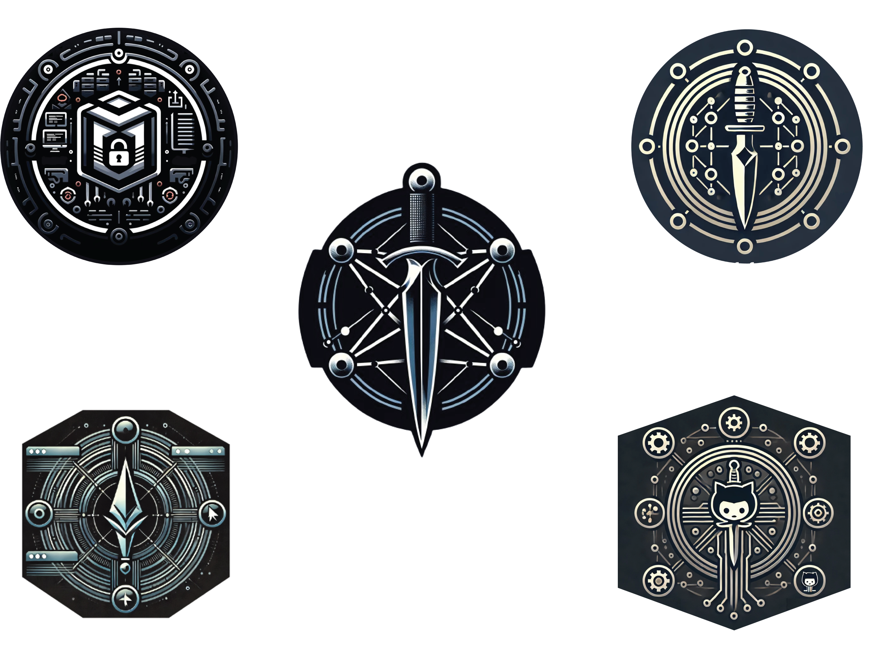

Introduction to the Blackdagger: Cyber Workflow Automation Framework
===================================================================

Blackdagger is a powerful, user-friendly framework designed to orchestrate complex workflows in DevOps, DevSecOps, MLOps, MLSecOps, and Continuous Automated Red Teaming (CART) environments.

To improve usability and streamline complex workflows, the team introduced a structured framework around Blackdagger. This includes pre-configured YAML files for common use cases and deployable infrastructure for Continuous Automated Red Teaming (CART) and DevSecOps. These additions are consolidated under the Blackdagger: Cyber Workflow Automation Framework, providing a cohesive solution that enhances the tool's overall effectiveness.

The framework consists of 5 components:

- `Blackdagger: <https://github.com/ErdemOzgen/blackdagger>`_ Core of the framework for orchestrating the components and workflows.
- `Blackcart: <https://github.com/ErdemOzgen/blackcart>`_ A specialized Docker container optimized for Continuous Automated Red Teaming (CART) and DevSecOps pipeline tasks.
- Blackdagger YAMLs: Pre-tested `example <https://github.com/ErdemOzgen/blackdagger-default>`_ workflows, demonstrating real-world `DevSecOps <https://github.com/ErdemOzgen/blackdagger-devsecops>`_ and `CART <https://github.com/ErdemOzgen/blackdagger-cart>`_ use-cases, facilitating quick adoption and adaptation.
- `Blackdagger Github Infra: <https://github.com/ErdemOzgen/blackdagger-github-infra>`_ A suite of advanced workflows utilizing GitHub Actions infrastructure for enhanced defense evasion techniques, scalability, and performance.
- `Blackdagger Web Kit: <https://github.com/ErdemOzgen/blackdagger-web-kit>`_ A browser extension integrating all core functionalities, enabling direct interaction and execution of Blackdagger workflows from within the browser.

---

Each component within the framework is designed for interoperability, allowing seamless integration across various environments and use cases with maximum ease, speed, and efficiency. The framework is modular, supporting the addition, removal, or modification of components to introduce new features or adapt to evolving requirements.

With Blackdagger at its core, this documentation will cover the abilities of the framework significantly. Please refer to the related documentation pages under this title for more information about the components.
