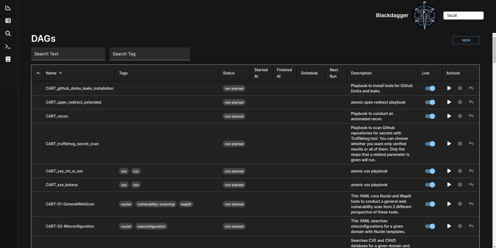
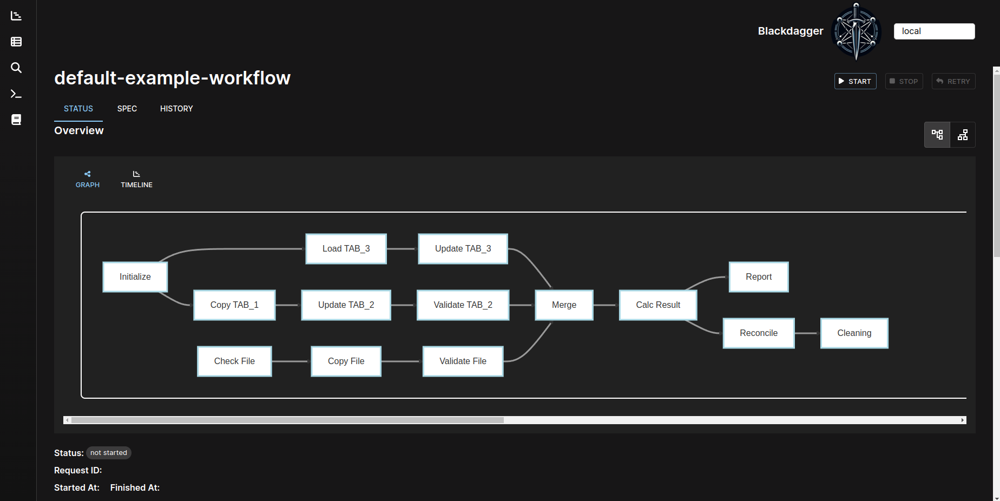
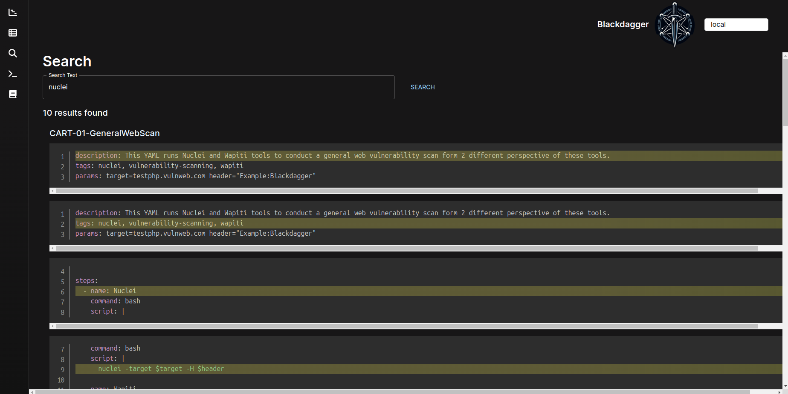
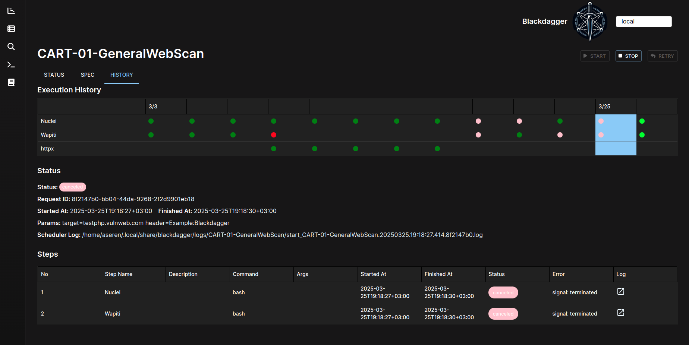
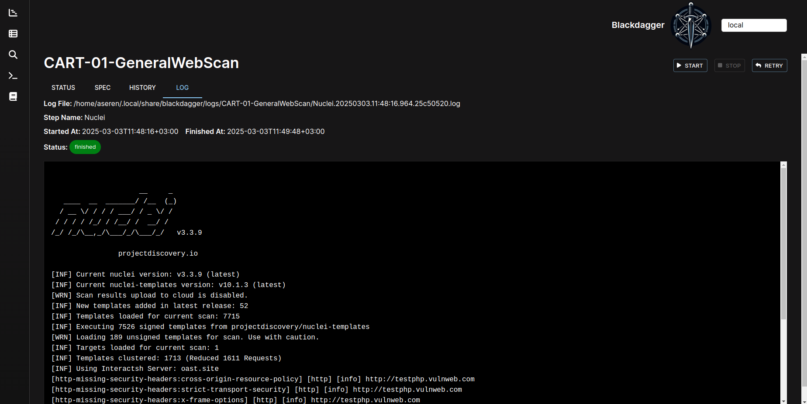

Web Interface
=============

.. contents::
    :local:

DAG List
---------

It shows all DAGs and the real-time status.

DAG Details
------------
It shows the real-time status, logs, and DAG configurations. You can edit DAG configurations on a browser.
You can switch to the vertical graph with the button on the top right corner.

DAG Search
-----------

It searches given text across all DAGs.

Execution History
------------------

It shows past execution results and logs.

DAG Execution Log
------------------

It shows the detailed log and standard output of each execution and step.

